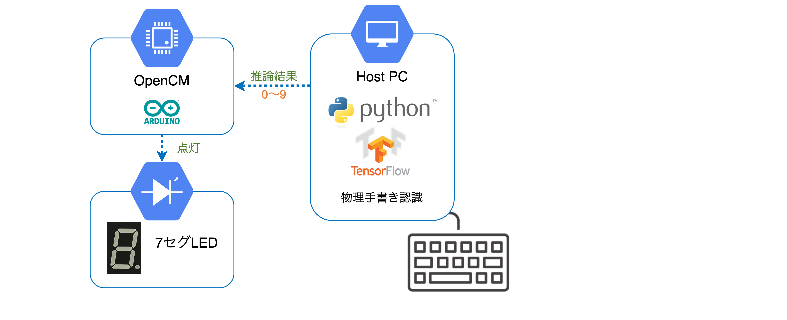

# 物理手書き文字認識

実世界情報演習 2 の自由課題

## Description

This project's objective is to recognize physically written characters.

You are only allowed to enter numbers. After writing the numerical value, the recognition result is displayed on the 7seg LED.

## Architecture



## Requiremenst

- Python ~> 3.8
- pipenv

## Installation

If you don't have pipenv installed, see [documents](https://github.com/pypa/pipenv).

```sh
$ git clone <this repo>
$ cd <this repo>

$ cd src
$ pipenv install
```

## Usage

See `scripts` section of [Pipfile](./src/Pipfile)

- `pipenv run test`
- `pipenv run format`
- `pipenv run lint`

### Show help

```sh
$ pipenv run ./app.py -h
```

### Record teacher data

```sh
$ pipenv run ./app.py --record
```

### Training

```sh
$ pipenv run ./app.py --train # --dim <DIM>
```

### Infer

If you want to turn on the LED by Arduino, you need to specify the `--port` option.

Before that, you need to upload the [program](./src/led/led.ino) to Arduino.

```sh
$ pipenv run ./app.py --infer --port <serial port> # --dim <DIM>
```

## References

- [Gboard 物理手書きバージョン](https://landing.google.co.jp/tegaki/)
